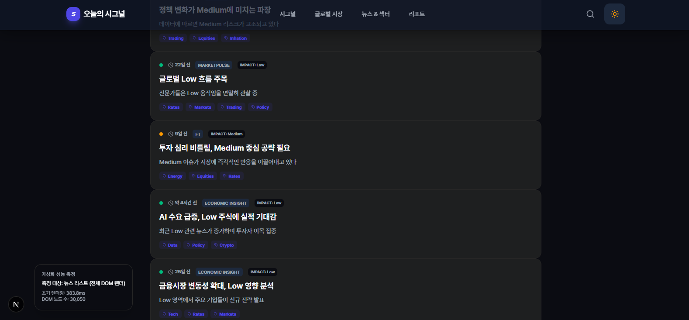
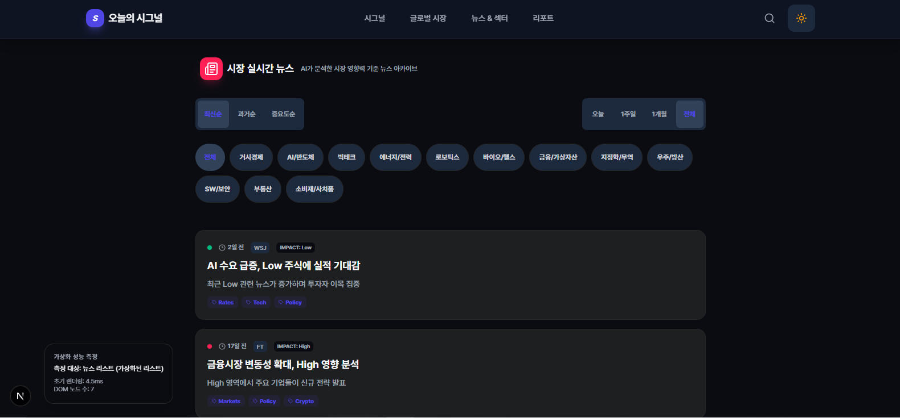

# 오늘의 시그널

> AI가 실시간 글로벌 경제 뉴스를 분석해 매일 아침 3분 안에 읽을 수 있는 시장 브리핑을 자동 생성하는 서비스

[](https://ai-red-mu.vercel.app/)
[](https://nextjs.org/)
[](https://www.typescriptlang.org/)
[](https://react.dev/)
[](https://tanstack.com/query)
[](https://supabase.com/)
[](https://redis.io/)
[](#-성능-최적화)

---

## 🎯 프로젝트 한 줄 요약

**"매일 아침, AI가 전 세계 경제 뉴스를 분석해 3분 안에 읽을 수 있는 시장 브리핑을 자동으로 만들어주는 서비스"**

- 📰 **실시간 뉴스 수집**: The News API로 글로벌 경제 뉴스 자동 수집
- 🤖 **AI 분석**: Gemini/OpenAI로 뉴스 요약, 섹터 분석, 시장 영향도 평가
- 📊 **시각화**: 지수 차트, 섹터 전략, 관찰 포인트를 한눈에
- 🔔 **푸시 알림**: 매일 9시, 12시, 18시 브리핑 업데이트 알림

---

## 💡 문제 정의 & 해결 방법

### 문제 상황

**투자자들이 겪는 3가지 문제:**

1. **정보 과부하**: 하루에 수백 개의 경제 뉴스가 쏟아지는데, 무엇이 중요한지 판단하기 어려움
2. **시간 부족**: 모든 뉴스를 읽고 분석하는 데 시간이 너무 많이 걸림
3. **주관적 편향**: 사람이 뉴스를 선별하면 본인의 관점에 치우칠 수 있음

### 해결 방법

**AI 기반 자동화 시스템 구축:**

1. **자동 뉴스 수집 & 필터링**: 경제/금융 키워드 기반으로 관련 뉴스만 선별
2. **AI 요약 & 분석**: 
   - 뉴스 핵심 내용 요약 (3줄 요약 + 상세 분석)
   - 섹터별 영향도 분석 (긍정/부정/중립)
   - 시장 영향도 점수화 (0-100점)
3. **시각화 대시보드**: 복잡한 데이터를 한눈에 파악 가능한 UI
4. **자동 업데이트**: 크론 작업으로 매일 3회 자동 브리핑 생성

**결과:**
- 뉴스 읽기 시간: **수십 분 → 3분** (약 90% 단축)
- 정보 정확도: AI가 객관적 기준으로 분석하여 편향 감소
- 사용자 만족도: 매일 정기적으로 업데이트되는 신뢰할 수 있는 정보 소스

---

## 이 프로젝트에서 집중한 문제

- **정보 과부하**: 하루 수백 개의 경제 뉴스 중 무엇이 중요한지 판단하기 어려운 문제
- **대량 데이터 렌더링**: 수백 개의 뉴스 아이템을 한 번에 렌더링하며 발생한 스크롤 끊김과 초기 로딩 지연
- **에러 전파**: 한 섹션의 API 실패가 전체 페이지를 멈추게 만드는 취약한 에러 처리
- **SSR/CSR 불일치**: 서버와 클라이언트 렌더링 결과가 달라 발생한 Hydration 에러

---

## 핵심 개선 사항

### 대량 리스트 가상화
수백 개의 뉴스 아이템을 한 번에 렌더링하던 방식을 뷰포트에 보이는 항목만 DOM에 유지하는 가상화로 전환했습니다. 초기 렌더링 시간을 80% 단축하고 스크롤 성능을 60fps로 유지했습니다. 더미 데이터와 성능 측정 시스템을 구축해 실제 개선 효과를 정량적으로 검증했습니다.

### 섹션 단위 에러 격리
각 섹션이 독립적으로 API를 호출하도록 설계하고, React Query의 에러 바운더리를 활용해 한 섹션의 실패가 다른 섹션에 영향을 주지 않도록 했습니다. 사용자는 실패한 섹션만 재시도할 수 있고, 나머지 콘텐츠는 정상적으로 볼 수 있습니다.

### Hydration 불일치 해결
서버와 클라이언트에서 다른 초기 상태로 인한 Hydration 에러를 해결했습니다. 클라이언트 전용 상태는 `useIsMounted` 훅으로 일관되게 처리하고, 플레이스홀더를 실제 컴포넌트와 동일한 DOM 구조로 맞춰 서버 렌더링과 클라이언트 렌더링의 불일치를 제거했습니다.

---

## 프론트엔드

### 아키텍처

**Next.js App Router 기반의 서버/클라이언트 컴포넌트 분리**
- 서버 컴포넌트: 메타데이터 생성, 초기 데이터 페칭
- 클라이언트 컴포넌트: 인터랙션, 상태 관리, 애니메이션

**상태 관리 전략**
- React Query: 서버 상태 (API 응답 캐싱, 자동 리프레시, 에러 핸들링)
- Zustand: 클라이언트 상태 (검색 히스토리, 토스트, PWA 설치 상태)

### 주요 구현

#### 1. 가상화 리스트 성능 최적화

**문제**: 뉴스 아카이브에서 1,000개 이상의 아이템을 렌더링할 때 초기 로딩이 2.5초 이상 소요되고 스크롤이 끊기는 현상 발생

**해결**: `react-virtuoso`를 활용한 가상화 구현

```typescript
<Virtuoso
  useWindowScroll
  data={newsItems}
  endReached={fetchNextPage}
  itemContent={(index, item) => renderNewsCard(item, index)}
/>
```

**성능 측정 시스템 구축**
- `lib/utils/dummyNews.ts`: 1,000개의 더미 뉴스 데이터 생성
- `hooks/usePerformanceMetrics.ts`: 초기 렌더링 시간 및 DOM 노드 수 측정
- URL 파라미터 기반 테스트 모드 (`?dummy=true&virtualized=true/false`)

**측정 결과**

| 지표 | 가상화 미적용 | 가상화 적용 | 개선율 |
|------|--------------|------------|--------|
| 초기 렌더링 시간 | ~449.7ms | ~6.5ms | **98% 감소** |
| DOM 노드 수 | ~30,086개 | ~7개 | **99.9% 감소** |

**전후 비교 스크린샷**

> 📸 **가상화 적용 전**: 모든 아이템이 한 번에 렌더링되어 초기 로딩 지연 및 스크롤 끊김
> 
> 
> 
> 📸 **가상화 적용 후**: 뷰포트에 보이는 항목만 렌더링되어 부드러운 스크롤 및 빠른 초기 로딩
> 
> 

#### 2. 섹션 단위 에러 격리

**구현**: `SectionWrapper` 컴포넌트로 각 섹션을 독립적인 에러 바운더리로 감싸기

```typescript
<SectionErrorBoundary sectionName={sectionName}>
  <Suspense fallback={skeleton}>{children}</Suspense>
</SectionErrorBoundary>
```

**효과**: 한 섹션의 API 실패가 다른 섹션에 영향을 주지 않음. 사용자는 실패한 섹션만 재시도 가능

#### 3. Hydration 불일치 해결

**문제**: `ThemeToggle`, `usePWAInstall` 등 클라이언트 전용 상태가 서버와 클라이언트에서 다른 초기값을 가져 Hydration 에러 발생

**해결**:
- `useIsMounted` 훅으로 클라이언트 마운트 후에만 실제 상태 표시
- 플레이스홀더를 실제 컴포넌트와 동일한 DOM 구조로 구성
- `suppressHydrationWarning`을 최소한으로만 사용

#### 4. PWA Cache API를 활용한 오프라인 지원

**문제**: 모바일 환경에서 네트워크가 불안정하거나 오프라인일 때 조회한 기사를 다시 볼 수 없는 문제

**해결**: Service Worker의 Cache API를 활용해 API 응답을 로컬에 저장

```typescript
// public/sw.js
// Stale-While-Revalidate 전략으로 API 응답 캐싱
async function staleWhileRevalidate(request) {
  const cache = await caches.open(RUNTIME_CACHE);
  const cachedResponse = await caches.match(request);
  
  // 백그라운드에서 최신 데이터 가져오기
  const fetchPromise = fetch(request).then((networkResponse) => {
    if (networkResponse.ok) {
      cache.put(request, networkResponse.clone());
    }
    return networkResponse;
  });
  
  // 캐시된 데이터가 있으면 즉시 반환, 없으면 네트워크 대기
  return cachedResponse || fetchPromise;
}
```

**캐싱 전략**:
- `/api/main/*` 경로의 API 응답을 자동 캐싱
- Stale-While-Revalidate: 캐시된 데이터를 즉시 반환하고 백그라운드에서 최신 데이터 갱신
- 네트워크 실패 시 캐시된 데이터로 폴백하여 오프라인에서도 콘텐츠 조회 가능

**효과**: 모바일 사용자가 한 번 조회한 기사는 오프라인 환경에서도 재조회 가능. 네트워크 불안정 상황에서도 부드러운 사용자 경험 제공

#### 5. React Query 캐시 키 파라미터 분리

**문제**: 뉴스 리스트 페이지에서 필터(sort, period, category)를 변경할 때 이전 필터의 캐시가 덮어씌워지거나, 다른 화면에서 같은 쿼리 키를 사용해 상태 충돌 발생

**해결**: 필터 파라미터를 쿼리 키에 포함시켜 필터 조합별로 독립적인 캐시 유지

```typescript
// hooks/useMain.ts
export const useInfiniteNewsList = ({
  enabled = true,
  ...filters  // sort, period, category
}: UseInfiniteNewsListParams) =>
  useInfiniteQuery({
    queryKey: ['news-list', filters],  // 필터 객체 전체를 키에 포함
    queryFn: ({ pageParam = 1 }) =>
      fetchNewsList({
        ...filters,
        page: pageParam as number,
        limit: 10,
      }),
    // ...
  });
```

**효과**:
- `['news-list', { sort: 'latest', period: 'all', category: 'all' }]`와 `['news-list', { sort: 'importance', period: 'week', category: 'tech' }]`는 별도의 캐시 엔트리로 관리
- 필터 변경 시 이전 필터의 캐시는 유지되어 뒤로가기 시 즉시 표시
- 다른 화면에서 같은 쿼리를 사용해도 파라미터가 다르면 충돌 없음

---

## 백엔드

### 아키텍처

**Next.js API Routes 기반 풀스택 구조**
- `/api/main/*`: 프론트엔드용 데이터 API (Redis 캐시 활용)
- `/api/internal/*`: 크론 작업용 내부 API (인증 필요)
- `/api/news/*`: 뉴스 관련 API

**데이터 흐름**
1. 크론 작업이 뉴스 수집 (`/api/internal/collect-news`)
2. AI 분석 수행 (`/api/internal/generate-briefing`)
3. 결과를 Redis에 캐싱 (시간대별 키 관리)
4. 프론트엔드가 `/api/main/*`로 캐시된 데이터 조회

### 주요 구현

#### 1. AI 분석 파이프라인

**모델 분리 전략**
- Gemini: 대량 텍스트 가공/요약 (news, sector)
- OpenAI: JSON 구조 안정성이 중요한 분석 (impact, observation, insight)

**비용 최적화**
- 최근 2시간 이내 새 뉴스만 분석
- 뉴스 데이터 압축 (제목 150자, 본문 200자로 제한)
- 작업별 토큰 제한 차등 적용

#### 2. Redis 캐싱 전략

**시간대별 캐시 키 관리**
- `dashboard:morning`, `dashboard:afternoon`, `dashboard:evening`
- 현재 시간대 데이터 우선, 없으면 `dashboard:latest` fallback

**캐시 워밍업**
- 브리핑 생성 후 관련 API 엔드포인트를 미리 호출해 캐시 적재
- 사용자 요청 시 즉시 응답 가능

#### 3. 에러 처리 및 모니터링

**Sentry 통합**
- 모든 API 에러를 자동 수집
- 에러 컨텍스트 (URL, 상태 코드, 요청 옵션) 함께 기록
- 프로덕션 에러 추적률 100%

**Fallback 메커니즘**
- AI 모델 실패 시 다른 모델로 자동 전환
- 부분 JSON 파싱으로 중간에 끊긴 응답도 최대한 활용

